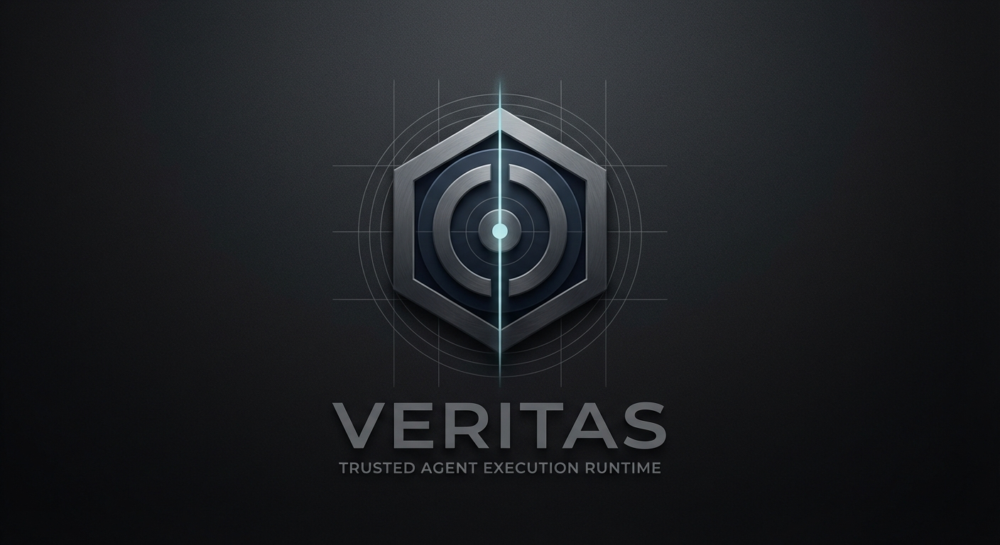

<p align="center">
  
</p>

<p align="center">
  
  
  
  
</p>

<p align="center">
  <strong>Making good agents better — safe, auditable, and verifiable — without making them slow.</strong>
</p>

---

Lightweight, deterministic, policy-bound, auditable, and verifiable execution runtime for AI agents operating in regulated environments.

> Reference domain: Healthcare

## The Idea

Agent runtimes like [ZeroClaw](https://github.com/zeroclaw-labs/zeroclaw) and [OpenClaw](https://github.com/openclaw/openclaw) proved that AI agents can be fast, tiny, and deployable anywhere. But they were not built for environments where every action must be traceable, policy-constrained, and verifiable.

VERITAS does not replace them. It wraps them with trust.

```
Linux Kernel        →  ZeroClaw / OpenClaw    (fast, minimal, runs anywhere)
Red Hat Enterprise  →  VERITAS                (trusted, governed, auditable)
```

## Execution Model

```
State → Policy → Capability → Audit → Verify → Next State
```

## Architecture

```
┌─────────────────────────────────────────────────────┐
│              Application / Agent Code               │
│         (LangGraph, CrewAI, OpenClaw, etc.)         │
├─────────────────────────────────────────────────────┤
│                    VERITAS                           │
│   Policy Engine │ Audit Trail │ Verifier │ Caps     │
├─────────────────────────────────────────────────────┤
│              Agent Runtime Kernel                    │
│            (ZeroClaw or equivalent)                  │
└─────────────────────────────────────────────────────┘
```

## Core Components

| Component | Purpose |
|-----------|---------|
| `veritas-core/` | Deterministic runtime (ZeroClaw lineage) |
| `veritas-policy/` | Deny-by-default permission & risk engine |
| `veritas-audit/` | Immutable, append-only execution trace |
| `veritas-verify/` | Output validation before delivery |
| `veritas-contracts/` | Capability / policy / audit schemas |

## Trust Boundary

| Trusted | Untrusted |
|---------|-----------|
| Runtime core | LLM |
| Policy engine | Tools |
| Audit engine | Input data |
| Verifier | External environment |

## Design Principles

1. Control over autonomy
2. Evidence over intelligence
3. Determinism over emergence
4. Deny by default
5. Capability-based security
6. Minimal trusted computing base
7. Auditability by design
8. Verifiable execution
9. Human override always possible
10. Data-model independence

> **Lightweight by conviction.** Governance must not be the reason agents become slow, heavy, or hard to build.

## Documentation

See [`docs/`](./docs) for full documentation.

### Whitepaper v0.3

| Language | Link |
|----------|------|
| English | [WHITEPAPER.en.md](docs/whitepaper/WHITEPAPER.en.md) |
| 简体中文 | [WHITEPAPER.zh.md](docs/whitepaper/WHITEPAPER.zh.md) |
| 日本語 | [WHITEPAPER.ja.md](docs/whitepaper/WHITEPAPER.ja.md) |
| Français | [WHITEPAPER.fr.md](docs/whitepaper/WHITEPAPER.fr.md) |

## Quick Start

### Prerequisites

- Rust 1.70+ ([install](https://rustup.rs/))

### Build & Test

```bash
git clone https://github.com/veritas-rt/veritas.git
cd veritas
cargo test --workspace       # 58 tests, all passing
```

### Run the Healthcare Demo

```bash
cargo run -p demo -- run-all
```

<p align="center">
  
</p>

### Interactive TUI Demo

```bash
cargo run -p veritas-tui
```

The TUI lets you select scenarios, toggle patient consent and agent capabilities, and watch VERITAS enforce policy in real time.

## Contributing

VERITAS is open source. Community contributions — including new translations — are welcome. See [CONTRIBUTING.md](CONTRIBUTING.md) for details.

## License

Licensed under Apache License 2.0. See [LICENSE](LICENSE) for details.
