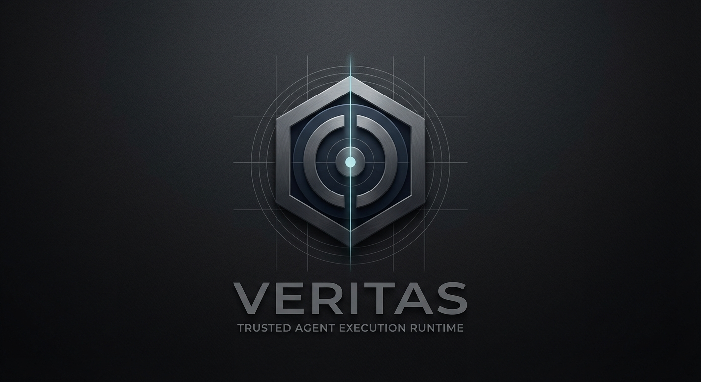

<p align="center">
  
</p>

<p align="center">
  
  
  
  
</p>

<p align="center">
  <strong>Making good agents better — safe, auditable, and verifiable — without making them slow.</strong>
</p>

---

Lightweight, deterministic, policy-bound, auditable, and verifiable execution runtime for AI agents operating in regulated environments.

> Reference domain: Healthcare

## Quick Start

```bash
git clone https://github.com/Chesterguan/veritas.git
cd veritas
cargo test --workspace       # 58 tests, all passing
cargo run -p demo -- run-all # run all 5 healthcare scenarios
```

<p align="center">
  
</p>

Or launch the interactive TUI:

```bash
cargo run -p veritas-tui
```

The TUI lets you select scenarios, toggle patient consent and agent capabilities, and watch VERITAS enforce policy in real time.

**Prerequisites:** Rust 1.74+ ([install](https://rustup.rs/))

## Why VERITAS

Agent runtimes like [ZeroClaw](https://github.com/zeroclaw-labs/zeroclaw) and [OpenClaw](https://github.com/openclaw/openclaw) proved that AI agents can be fast, tiny, and deployable anywhere. But they were not built for environments where every action must be traceable, policy-constrained, and verifiable.

VERITAS does not replace them. It wraps them with trust.

```
Linux Kernel        →  ZeroClaw / OpenClaw    (fast, minimal, runs anywhere)
Red Hat Enterprise  →  VERITAS                (trusted, governed, auditable)
```

## Architecture

```
┌─────────────────────────────────────────────────────┐
│              Application / Agent Code               │
│         (LangGraph, CrewAI, OpenClaw, etc.)         │
├─────────────────────────────────────────────────────┤
│                    VERITAS                           │
│   Policy Engine │ Audit Trail │ Verifier │ Caps     │
├─────────────────────────────────────────────────────┤
│              Agent Runtime Kernel                    │
│            (ZeroClaw or equivalent)                  │
└─────────────────────────────────────────────────────┘
```

### Execution Model

Every agent action follows the same deterministic pipeline — no exceptions, no shortcuts:

```
State → Policy → Capability → Audit → Verify → Next State
```

### Trust Boundary

| Trusted | Untrusted |
|---------|-----------|
| Runtime core | LLM |
| Policy engine | Tools |
| Audit engine | Input data |
| Verifier | External environment |

## Core Components

| Crate | Purpose | Tests |
|-------|---------|-------|
| [`veritas-contracts`](crates/veritas-contracts) | Shared types, traits, error types | 15 |
| [`veritas-core`](crates/veritas-core) | Deterministic executor pipeline | 6 |
| [`veritas-policy`](crates/veritas-policy) | TOML deny-by-default policy engine | 8 |
| [`veritas-audit`](crates/veritas-audit) | SHA-256 hash-chained audit trail | 6 |
| [`veritas-verify`](crates/veritas-verify) | JSON Schema + semantic rule verification | 10 |
| [`veritas-ref-healthcare`](crates/veritas-ref-healthcare) | Healthcare reference runtime (5 scenarios) | 13 |

## Healthcare Demo Scenarios

| # | Scenario | What it demonstrates |
|---|----------|---------------------|
| 1 | **Drug Interaction Checker** | Policy Allow flow, output schema verification |
| 2 | **Clinical Note Summarizer** | PII detection via custom verifier rule |
| 3 | **Patient Data Query** | Capability-based access control, consent enforcement |
| 4 | **Multi-Agent Clinical Pipeline** | 4-agent chain with independent audit trails |
| 5 | **Prior Authorization Workflow** | RequireApproval lifecycle with physician approval |

Run individually:

```bash
cargo run -p demo -- drug-interaction
cargo run -p demo -- note-summarizer
cargo run -p demo -- patient-query
cargo run -p demo -- clinical-pipeline
cargo run -p demo -- prior-auth
```

## Design Principles

1. Control over autonomy
2. Evidence over intelligence
3. Determinism over emergence
4. Deny by default
5. Capability-based security
6. Minimal trusted computing base
7. Auditability by design
8. Verifiable execution
9. Human override always possible
10. Data-model independence

> **Lightweight by conviction.** Governance must not be the reason agents become slow, heavy, or hard to build.

## Project Structure

```
crates/
  veritas-contracts/       # Shared types, traits, error types
  veritas-core/            # Deterministic executor pipeline
  veritas-policy/          # TOML deny-by-default policy engine
  veritas-audit/           # SHA-256 hash-chained audit trail
  veritas-verify/          # JSON Schema + semantic rule verification
  veritas-ref-healthcare/  # Healthcare reference runtime (5 scenarios)
demo/                      # CLI demo runner (clap)
tui/                       # Interactive TUI demo (ratatui)
docs/
  whitepaper/              # Whitepaper v0.3 (EN, ZH, JA, FR)
  yellowpaper/             # Yellow Paper v0.1 (EN)
```

## Documentation

| Document | Description |
|----------|-------------|
| [Whitepaper v0.3](docs/whitepaper/WHITEPAPER.en.md) | Vision, design philosophy, system architecture |
| [Yellow Paper v0.1](docs/yellowpaper/YELLOWPAPER.en.md) | Formal execution semantics and specifications |
| [docs/](docs/README.md) | Full documentation index |

### Whitepaper Translations

| Language | Link |
|----------|------|
| English | [WHITEPAPER.en.md](docs/whitepaper/WHITEPAPER.en.md) |
| 简体中文 | [WHITEPAPER.zh.md](docs/whitepaper/WHITEPAPER.zh.md) |
| 日本語 | [WHITEPAPER.ja.md](docs/whitepaper/WHITEPAPER.ja.md) |
| Français | [WHITEPAPER.fr.md](docs/whitepaper/WHITEPAPER.fr.md) |

## Contributing

VERITAS is open source. Community contributions — including new translations — are welcome. See [CONTRIBUTING.md](CONTRIBUTING.md) for details.

## License

Licensed under Apache License 2.0. See [LICENSE](LICENSE) for details.
